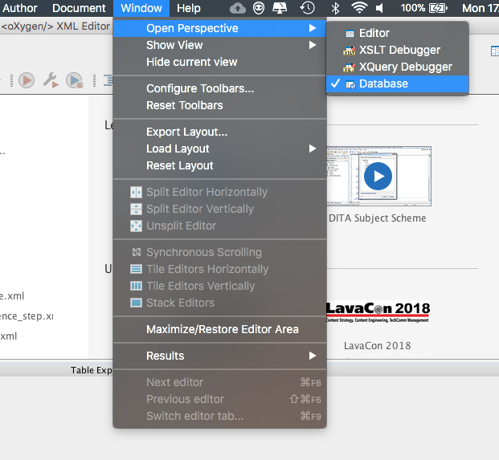
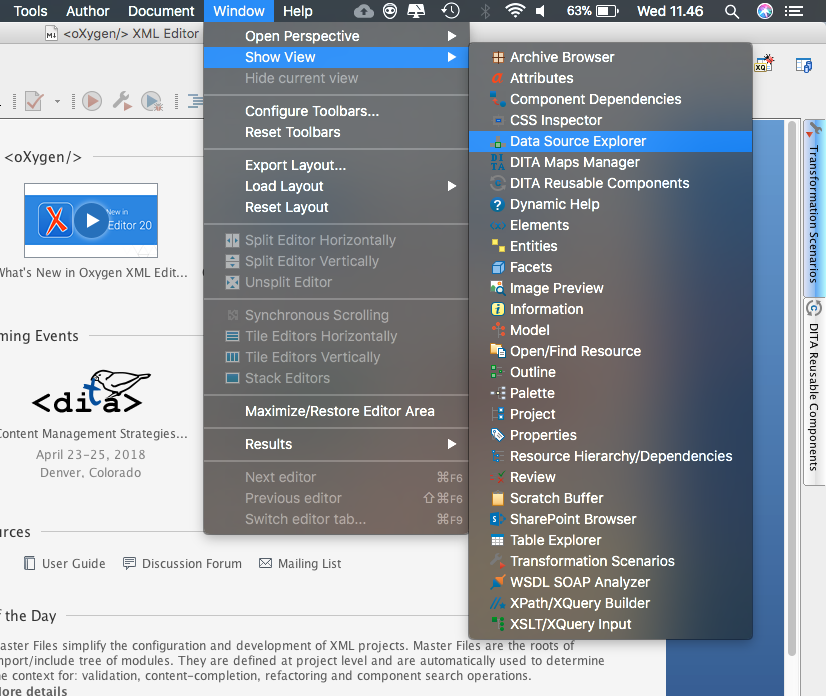
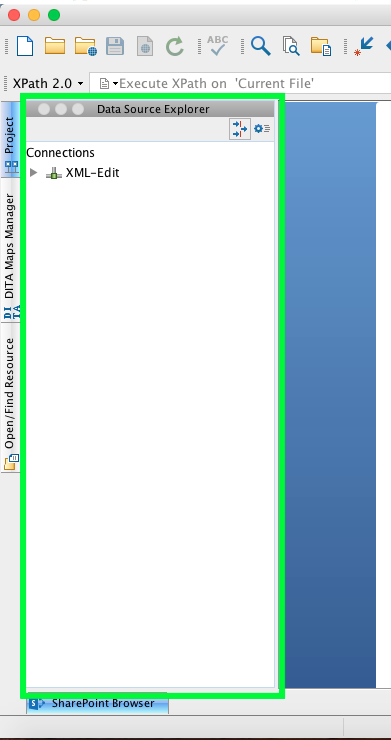

#Oxygen Xml Einrichtung für Nutzende

## Die Datenbank Verbinden

### 1. Datenbankansicht öffnen

### 2. Datenbankquelle anlegen

Klicken Sie auf das grün markierte Symbol, eine neue Datenbankquelle anzulegen.

### 3. Neue Datenbankverbindung Erstellen

- Bei `Data Source` sollten Sie `WebDAV FTP` wählen.
- Klicken Sie bei den `Connections` auf das Plus-Symbol, um eine neue Datenbankverbindung zu erstellen.

Geben Sie diese Daten ein:

- **Name**, wie z.B. "XML-Edit".
- Beim **Data Source** sollten Sie **WebDAV** auswählen.
- Die **WebDAV/FTP URL** sollte die folgende URL sein:

`https://xmledit.bbaw.de/expath/webdav/db/apps/corpuscoranicum/data`

- Geben Sie Ihre **Username** und **Passwort** ein.

Klicken Sie auf OK.

### 4. Datenbank verbinden

Klicken Sie auf die neue Datenbank, um sie zu verbinden.

### 5. Datenbank nutzen

Wenn es mit der Verbindung geklappt hat, sieht die Datenbankverbindung so aus:

## Datenbankquellen Anzeigen

Wenn man die Datenbankquellen aus Versehen geschlossen hat, kann man sie wieder anzeigen.
Klicken Sie auf `Window -> Show View -> Data Source Explorer`.

Sie wird wieder angezeigt:

