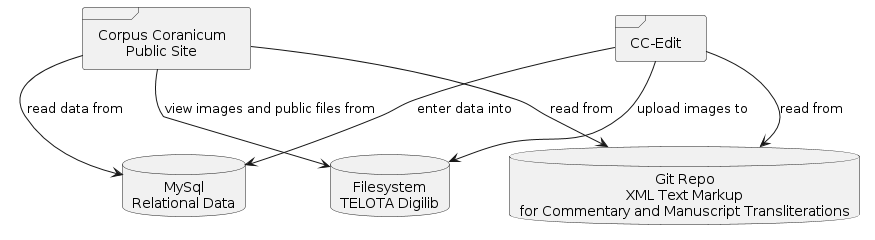

# cc-edit

## About
`cc-edit` is the content management system for Corpus Coranicum.

Here is an overview of how CCEdit fits in with the overall architecture:


```
@startuml
skinparam defaultTextAlignment center
database MySql as "MySql\nRelational Data"
database XML as "Git Repo\nXML Text Markup\nfor Commentary and Manuscript Transliterations"
database Digilib as "Filesystem\nTELOTA Digilib"
frame cc as "Corpus Coranicum\nPublic Site"
frame cc_edit as "CC-Edit"
cc --> MySql: read data from
cc --> XML: read from
cc_edit --> MySql: enter data into
cc_edit --> XML: read from
cc_edit --> Digilib: upload images to
cc --> Digilib: view images and public files from
@enduml
```

## Local Deployment

### System requirements:
- `php8.1`. The following packages are needed: defaults, pdo, mysql, gd, zip, curl, xml, mb-string. 
- Install, for example, with `sudo apt install php8.1-mysql` etc.
- node version 16 or 18.
- npm, yarn (installed via npm)

### Installation
- Acquire a dump of the corpus coranicum database, name it `dump.sql` and put in it your root folder.  Run `docker-compose up` to start a database instance.  This will also read in the dump file if it hasn't already.
- `composer install`
- `cp .env.example .env`
- `yarn install`
- `npm run dev` or `yarn run dev`

Finally, in a separate window: 
- `php artisan serve`

#### Database
You need a dump of the database to get started.
There is a docker-compose file in the root folder that can be used to set up the database.


## Server Setup

* Build frontend javascript assets with `yarn run dev`  

* Give `www-data` ownership of all storage: `sudo chown -R www-data ./storage`
* Set up a cronjob on the server for `php artisan schedule:run` with user `www-data`.
For example, enter `crontab -e -u www-data` and then add this line to the crontab:
```
# Corpus Coranicum Editor
* * * * * cd /opt/projects/ccdb_edit/src && php artisan schedule:run >> /dev/null 2>&1
```
The cronjob takes care of things like updating Zotero and updating Manuscript Passage Mappings.
Note that you could also trigger these manually, but make sure to do it as `www-data`.


### Example `nginx` Config
```
location ^~ /ccdb_edit {

    error_log /var/log/nginx/ccdb_edit.error.log error;

    charset utf-8;

    alias /opt/projects/ccdb_edit/src/public;
    index index.php index.html index.htm;

    try_files $uri $uri/ @ccdb_edit;

    location ~ .php$ {
        fastcgi_pass unix:/var/run/php/php8.1-fpm.sock;
        include fastcgi_params;
        fastcgi_param SCRIPT_FILENAME $request_filename;
        fastcgi_split_path_info ^(.+.php)(/.*)$;
    }

}

location @ccdb_edit {
    rewrite /ccdb_edit/(.*)$ /ccdb_edit/index.php?$1 last;
}
```


## Dependencies
* This project requires the `Corpus Coranicum XML Files` repository.
* If you want to upload images, you need a connection to Digilib.

## Useful Import Scripts
The Excel table of the Koran translations can be imported with the `ImportParetUebersetzung` console command.
